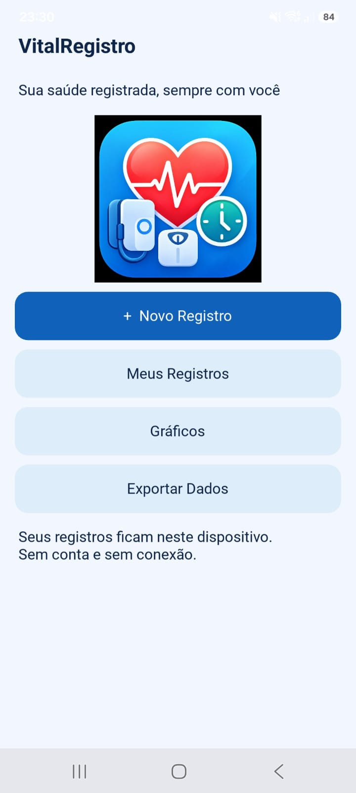
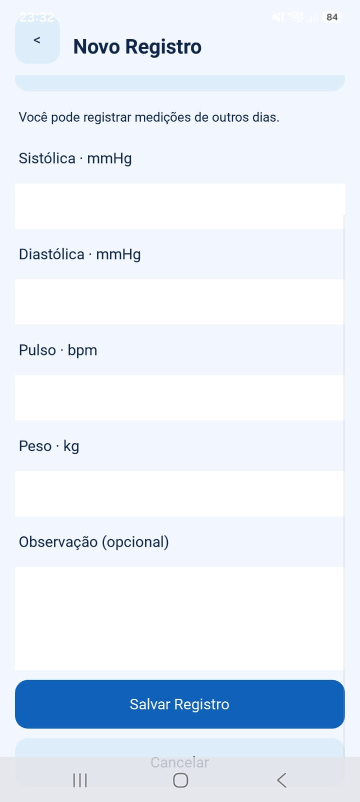
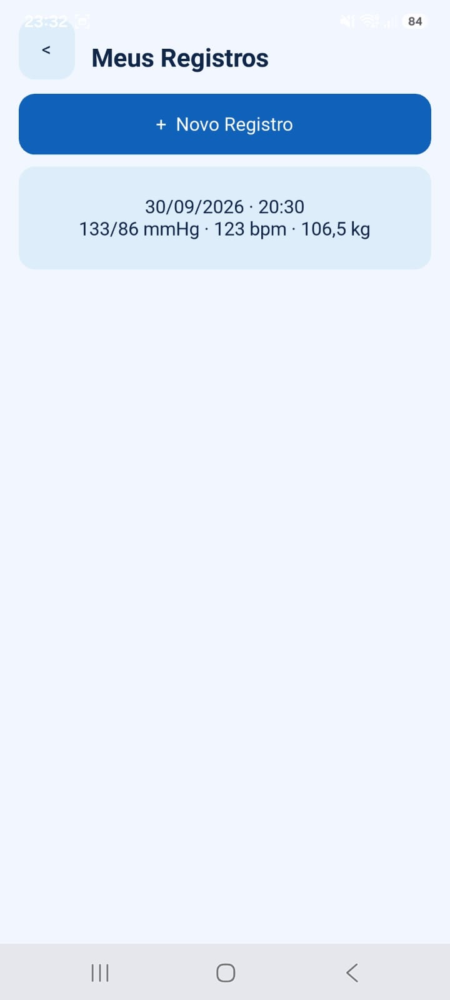
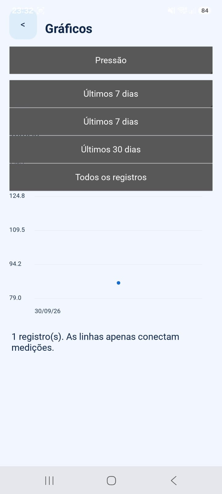

# VitalRegistro

Aplicativo Android open source desenvolvido em Python/Kivy para registrar medições independentes de pressão arterial (com pulso), peso e glicemia, cada uma com data, horário e observações. Funciona offline, com armazenamento local em SQLite.

## Sobre o projeto

O VitalRegistro surgiu de uma necessidade pessoal: após algumas semanas com dores frequentes na nuca, o autor comprou um aparelho de pressão arterial e decidiu organizar as medições em um histórico. Esse foi o motivo para começar o acompanhamento; não foi estabelecida uma relação entre o sintoma e pressão arterial elevada. Registra pressão sistólica/diastólica e pulso, peso e glicemia em mg/dL, em registros separados. **Data e horário são editáveis** e representam o momento real da medição, mesmo quando ela é inserida posteriormente.

**v0.2.0 em preparação para revisão, ainda sem validação em Android real.** A v0.1.0 permanece como marco publicado, conforme informado pelo autor, com uso básico confirmado no Samsung Galaxy M55 / Android 16. As evidências históricas e seus limites estão em [VALIDATION.md](docs/VALIDATION.md); elas não validam os recursos novos.

**Novo banco e novo CSV:** a v0.2.0 mantém o arquivo da v0.1.0 intacto e inicia um histórico separado. Não há migração nem importação de CSV v0.1.0. Ao detectar o arquivo antigo, o aplicativo avisa; não desinstale nem limpe os dados para fazer essa transição.

Funciona offline, sem anúncios, conta, assinatura ou telemetria. Os dados ficam no dispositivo. O histórico editável e os gráficos ajudam a apresentar medições organizadas a um médico ou outro profissional de saúde. **O VitalRegistro registra, organiza, apresenta e exporta dados; não realiza diagnóstico, não classifica automaticamente condições médicas e não substitui avaliação profissional.**

## Funcionalidades

- Criar, consultar, editar todos os campos e excluir registros com confirmação.
- Escolher Pressão arterial, Peso ou Glicemia antes de abrir um formulário com apenas os campos pertinentes.
- Selecionar data e hora em colunas rolantes, com encaixe no valor central, sem teclado; inclui datas históricas e anos bissextos.
- Histórico cronológico geral com filtros por tipo, detalhes, edição do mesmo tipo e exclusão confirmada.
- Peso decimal com vírgula ou ponto e observações de até 5000 caracteres.
- Gráficos de pressão, pulso, peso e glicemia: últimos 7 dias, 30 dias ou todo o histórico. Horários diferentes no mesmo dia têm posições temporais distintas.
- Toque/clique nos pontos exibe data, horário, valor e série; glicemia também mostra o contexto. Empates exatos abrem uma escolha de pontos.
- Contextos de glicemia: Jejum, Antes da refeição, Após a refeição e Outro; sem interpretação ou cálculo pós-prandial.
- Exportação e importação de CSV UTF-8, com UUID, prévia, confirmação e prevenção de duplicatas. Observações preservam aspas, vírgulas e quebras de linha.
- Confirmação antes de descartar um formulário alterado.

As validações numéricas apenas evitam erros de digitação; não classificam resultados nem fazem diagnóstico.

## Screenshots

Capturas históricas do primeiro APK no Samsung Galaxy M55 com Android 16, com **dados fictícios confirmados pelo autor**. Elas documentam a versão anterior aos ajustes de transparência, áreas seguras e seletores; não comprovam a aparência do artefato identificado abaixo.

<table>
  <tr><th>Home</th><th>Novo Registro</th><th>Meus Registros</th><th>Gráficos</th></tr>
  <tr>
    <td></td>
    <td></td>
    <td></td>
    <td></td>
  </tr>
</table>

Veja os [detalhes das capturas](docs/screenshots/README.md). A [apresentação original](docs/images/apresentacao.png) permanece como referência visual, não como screenshot.

## Tecnologias

- Python 3.12 ou 3.13 para execução local.
- Kivy 2.3.1 para interface, gráficos e seletores.
- SQLite, `decimal`, `csv` e `unittest` da biblioteca padrão.
- Buildozer e python-for-android para empacotamento Android.
- Pyjnius para exportar pelo seletor de documentos Android.

Não utiliza KivyMD, Matplotlib, servidor ou conta de usuário.

## Estrutura do projeto

```text
main.py                     # Entrada do aplicativo
vitalregistro/
  app.py                    # Telas e ações da interface
  models.py                 # Modelo e validação
  database.py               # Persistência SQLite / CRUD
  export.py                 # Geração e gravação CSV formato 2
  import_csv.py             # Validação, prévia e UUIDs de importação
  android_export.py         # Exportação pelo Storage Access Framework
  android_import.py         # Leitura pelo Storage Access Framework
  picker_logic.py           # Datas válidas e encaixe das colunas
  chart_logic.py            # Projeção temporal e seleção por proximidade
  periods.py                # Filtros por dias
  ui/                       # Widgets, gráficos e theme.kv
assets/icons/icone.png      # Ícone oficial
tests/test_core.py          # Testes com dados fictícios
scripts/                    # Smoke da interface e preparação Linux
docs/                       # Build, publicação, validação e Colab
.github/workflows/tests.yml # CI de lógica Python
buildozer.spec              # Configuração Android
requirements.txt            # Execução
requirements-build.txt      # Ferramentas de compilação Linux
```

## Executando localmente

Clone o repositório:

```bash
git clone https://github.com/akioShaolin/vital-registro.git
cd vital-registro
```

Windows (PowerShell):

```powershell
py -3.13 -m venv .venv
.\.venv\Scripts\python.exe -m pip install -r requirements.txt
.\.venv\Scripts\python.exe main.py
```

Linux/macOS, com Python 3.12 ou 3.13 instalado:

```bash
python3 -m venv .venv
source .venv/bin/activate
python -m pip install -r requirements.txt
python main.py
```

Se `ensurepip` falhar ao criar o ambiente no Windows, uma instalação existente do pip pode prepará-lo com `py -3.13 -m pip --python .venv install pip`; depois execute os comandos acima. A interface precisa de sessão gráfica e suporte OpenGL.

### Testes

Os testes da lógica não precisam do Kivy nem de dependências extras:

```bash
python -m unittest discover -s tests -v
python -m compileall -q main.py vitalregistro scripts tests
```

No Windows, utilize `.\.venv\Scripts\python.exe` no lugar de `python`. Para um teste de integração da interface, com Kivy instalado e sessão gráfica, execute `python scripts/smoke_ui.py`. Ele abre a janela brevemente e usa uma pasta temporária com dados fictícios.

## Android / APK

A compilação acontece em Linux x86_64, inclusive WSL2; não diretamente no Windows. O setup prepara CPython 3.14.7 isolado, Java 17, Buildozer e p4a `develop` em commits fixos, API 36 e NDK 29. O APK ARM64 tem mínimo Android 7 (API 24). O Python embarcado é 3.14.2, conforme as recipes fixadas do p4a.

Depois de preparar as ferramentas conforme [docs/ANDROID.md](docs/ANDROID.md):

```bash
.venv-build/bin/python scripts/build_android.py
```

O artefato documentado para o fechamento da v0.1.0 é `vitalregistro-0.1.0-arm64-v8a-debug.apk` (**26.306.986 bytes**, **DEBUG + ARM64-V8A**), conforme o [build-info.json fornecido](docs/releases/v0.1.0/build-info.json). Commit do projeto, SHA-256 informado e ambiente estão em [ANDROID.md](docs/ANDROID.md#evidência-do-build-da-v010). Esse JSON identifica somente o artefato histórico da v0.1.0. A configuração atual prepara a v0.2.0, cujo APK ainda precisa ser compilado e testado; não reutilize o JSON antigo para identificá-lo. Os APKs ficam em `bin/`, ignorado pelo Git. A configuração não solicita permissões de internet ou armazenamento e desativa o backup automático Android. O domínio `org.vitalregistro` é um identificador técnico inicial; não representa a posse de um domínio web.

## Google Colab

Abra [`docs/build_colab.ipynb`](docs/build_colab.ipynb) no Colab. O notebook clona `https://github.com/akioShaolin/vital-registro.git`, instala ferramentas, executa testes, compila e oferece download do APK. Publique as alterações do fluxo nesse repositório antes de executar. Não contém token nem depende do Google Drive. É necessário acesso à internet **no ambiente de compilação** para baixar ferramentas e código.

O build documentado utilizou kernel Colab **Python 3.13.15**. O notebook prepara o Python de build 3.14.7 separadamente, sem substituir esse kernel. A cadeia de build foi preservada na v0.2.0; os testes de hardware confirmados e as verificações pendentes estão em [VALIDATION.md](docs/VALIDATION.md). Veja a [matriz e as fontes oficiais](docs/ANDROID.md).

## Armazenamento dos dados

O arquivo `vitalregistro-v2.sqlite3` (schema 2) fica no diretório retornado por `App.user_data_dir`, fora do código. No Windows, normalmente `%APPDATA%\vitalregistro`; no Linux, `~/.config/vitalregistro`; no Android, no armazenamento privado do aplicativo. O nome exato da pasta Android depende do pacote instalado.

O banco pessoal **não faz parte do repositório**. As gravações são transacionais e registros têm UUID permanente. Uma falha de leitura não provoca recriação destrutiva do banco. Desinstalar o aplicativo ou limpar seus dados pode remover o histórico: exporte antes se quiser preservá-lo. O SQLite não é criptografado pelo aplicativo.

**Armazenamento exclusivamente local:** não há conta online, sincronização ou backup em nuvem. Perder ou danificar o aparelho, formatá-lo ou remover o aplicativo com seus dados pode resultar na perda do histórico. A exportação CSV é o mecanismo disponível para manter uma cópia externa; guarde essa cópia fora do aparelho se quiser protegê-la também contra perda do dispositivo. A v0.2.0 permite reimportar seu próprio CSV mediante seleção, prévia e confirmação; não há backup ou restauração automática.

## Exportação e importação CSV

Use **Exportar Dados** para copiar todo o histórico v0.2.0. O [formato CSV 2](docs/CSV.md) inclui UUID, tipo e timestamp ISO local (`2026-10-05T08:12`), com peso em decimal exato. A frequência das medições é livre.

- **Desktop:** exporta para `exports/` na pasta de dados. **Importar CSV** abre um seletor de arquivos, inicialmente nessa pasta de dados; navegue até o CSV desejado.
- **Android:** exporta com `ACTION_CREATE_DOCUMENT` e importa com `ACTION_OPEN_DOCUMENT` (SAF), sem permissões amplas de armazenamento. Provedores de nuvem podem aparecer se instalados; só são usados por escolha explícita do usuário.

A importação valida o arquivo antes de gravar e apresenta novos registros, duplicatas idênticas, conflitos de UUID e erros. Duplicatas idênticas são ignoradas. Qualquer erro ou UUID com conteúdo diferente bloqueia **todo o lote**; não há sobrescrita nem importação parcial. Confirmar grava os registros novos em uma transação com rollback em falha. Cancelar não grava nada. UUIDs são mantidos na edição e no round-trip banco → CSV → novo banco.

Limites de leitura: 10 MiB e 20.000 linhas de dados por arquivo. CSV da v0.1.0 não é aceito. Importar acrescenta registros, não sincroniza alterações/exclusões; um registro excluído pode reaparecer ao importar uma cópia antiga. Detalhes e exemplos em [docs/CSV.md](docs/CSV.md).

Observações são preservadas literalmente. Ao abrir CSV em planilhas, importe observações como texto, inclusive se começarem com `=`, `+`, `-` ou `@`.

**O SAF real, gestos touchscreen e comportamento Android da v0.2.0 ainda precisam ser validados.** Testes de adaptadores com simulações e smoke desktop não substituem essa etapa.

## Privacidade

- Funcionamento local, sem telemetria, analytics, publicidade ou login.
- Nenhum envio automático a servidores e nenhuma sincronização implementada.
- Dados de saúde permanecem no dispositivo; exportação somente por ação do usuário.
- Logs persistentes do Kivy desativados no ponto de entrada do aplicativo.
- Banco, exportações de runtime, credenciais e builds excluídos pelo `.gitignore`.

## Limitações conhecidas

- A confirmação de uso no Samsung Galaxy M55 refere-se à v0.1.0. Toda a v0.2.0 precisa de validação no aparelho, inclusive pickers, tooltips, importação/exportação e preservação do banco antigo.
- Sem intervalo personalizado de gráficos, sincronização ou criptografia própria. Timestamp representa data/hora local, sem conversão de fuso e com precisão de minuto.
- Bancos e CSVs v0.1.0 não são convertidos. Importações com conflitos devem ser resolvidas pelo usuário antes de tentar novamente.
- Gráficos mostram todas as medições do período; históricos grandes podem ficar densos. A lista limita widgets por lote, mas lê o histórico completo do banco.
- Formulário não salvo pode se perder se o sistema encerrar o processo; registros já salvos permanecem no SQLite.
- APK debug é para instalação e testes; publicação na Play Store exige assinatura e revisão dos requisitos vigentes.

## Possibilidades futuras

Ideias ainda não implementadas: intervalo personalizado nos gráficos e melhorias de acessibilidade baseadas em testes de uso. Sincronização ou backup em nuvem exigiriam uma decisão futura explícita sobre privacidade; não fazem parte da versão atual.

## Aviso

O VitalRegistro é uma ferramenta de registro e organização de dados pessoais e não substitui avaliação, diagnóstico ou orientação de profissionais de saúde.

## Contribuindo e publicando

Veja [CONTRIBUTING.md](CONTRIBUTING.md), [CHANGELOG.md](CHANGELOG.md) e o [guia de publicação](docs/PUBLISHING.md). Não envie dados pessoais em issues, testes ou capturas.

## Licença

Disponível sob a [MIT License](LICENSE).
