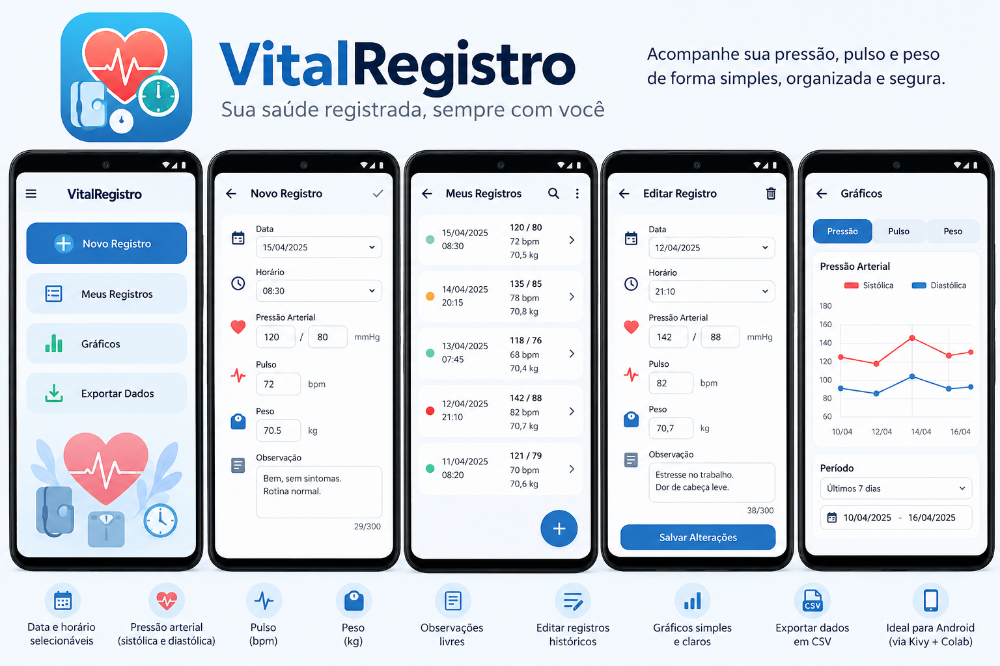

# VitalRegistro

Aplicativo Android open source desenvolvido em Python/Kivy para registrar pressão arterial sistólica e diastólica, pulso, peso, data, horário e observações. Funciona offline, com armazenamento local em SQLite.

## Sobre o projeto

Um diário pessoal simples para consultar e corrigir medições ao longo do tempo. **Data e horário são editáveis**: é possível registrar hoje uma medição realizada em outro dia.

O projeto está em desenvolvimento inicial (versão interna `0.1.0`). A configuração Android e o notebook de compilação estão preparados; isso não equivale a um APK validado em aparelho. Consulte [a validação](docs/VALIDATION.md).

## Funcionalidades

- Criar, consultar, editar todos os campos e excluir registros com confirmação.
- Selecionar data em calendário e horário por hora/minuto.
- Histórico do mais recente para o mais antigo, com detalhes e carregamento em lotes.
- Peso decimal com vírgula ou ponto e observações de até 5000 caracteres.
- Gráficos de pressão, pulso e peso: últimos 7 dias, 30 dias ou todo o histórico.
- CSV UTF-8 mediante ação do usuário, com tratamento de aspas e quebras de linha.
- Confirmação antes de descartar um formulário alterado.

As validações numéricas apenas evitam erros de digitação; não classificam resultados nem fazem diagnóstico.

## Screenshots

Esta imagem é a **referência de design**, não uma captura do aplicativo implementado. Números presentes na referência são ilustrativos.



Capturas reais poderão ser adicionadas em [`docs/screenshots/`](docs/screenshots/README.md), exclusivamente com dados fictícios.

## Tecnologias

- Python 3.12 ou 3.13 para execução local.
- Kivy 2.3.1 para interface, gráficos e seletores.
- SQLite, `decimal`, `csv` e `unittest` da biblioteca padrão.
- Buildozer e python-for-android para empacotamento Android.
- Pyjnius para exportar pelo seletor de documentos Android.

Não utiliza KivyMD, Matplotlib, servidor ou conta de usuário.

## Estrutura do projeto

```text
main.py                     # Entrada do aplicativo
vitalregistro/
  app.py                    # Telas e ações da interface
  models.py                 # Modelo e validação
  database.py               # Persistência SQLite / CRUD
  export.py                 # Geração e gravação CSV
  android_export.py         # Storage Access Framework
  periods.py                # Filtros por dias
  ui/                       # Widgets, gráficos e theme.kv
assets/icons/icone.png      # Ícone oficial
tests/test_core.py          # Testes com dados fictícios
scripts/                    # Smoke da interface e preparação Linux
docs/                       # Build, publicação, validação e Colab
.github/workflows/tests.yml # CI de lógica Python
buildozer.spec              # Configuração Android
requirements.txt            # Execução
requirements-build.txt      # Ferramentas de compilação Linux
```

## Executando localmente

Substitua `SEU_USUARIO` pelo proprietário do repositório após publicá-lo:

```bash
git clone https://github.com/SEU_USUARIO/vital-registro.git
cd vital-registro
```

Windows (PowerShell):

```powershell
py -3.13 -m venv .venv
.\.venv\Scripts\python.exe -m pip install -r requirements.txt
.\.venv\Scripts\python.exe main.py
```

Linux/macOS, com Python 3.12 ou 3.13 instalado:

```bash
python3 -m venv .venv
source .venv/bin/activate
python -m pip install -r requirements.txt
python main.py
```

Se `ensurepip` falhar ao criar o ambiente no Windows, uma instalação existente do pip pode prepará-lo com `py -3.13 -m pip --python .venv install pip`; depois execute os comandos acima. A interface precisa de sessão gráfica e suporte OpenGL.

### Testes

Os testes da lógica não precisam do Kivy nem de dependências extras:

```bash
python -m unittest discover -s tests -v
python -m compileall -q main.py vitalregistro scripts tests
```

No Windows, utilize `.\.venv\Scripts\python.exe` no lugar de `python`. Para um teste de integração da interface, com Kivy instalado e sessão gráfica, execute `python scripts/smoke_ui.py`. Ele abre a janela brevemente e usa uma pasta temporária com dados fictícios.

## Android / APK

A compilação acontece em Linux x86_64, inclusive WSL2; não diretamente no Windows. O setup prepara CPython 3.14.7 isolado, Java 17, Buildozer e p4a `develop` em commits fixos, API 36 e NDK 29. O APK ARM64 tem mínimo Android 7 (API 24). O Python embarcado é 3.14.2, conforme as recipes fixadas do p4a.

Depois de preparar as ferramentas conforme [docs/ANDROID.md](docs/ANDROID.md):

```bash
.venv-build/bin/python scripts/build_android.py
```

O resultado esperado fica em `bin/*.apk`. A configuração não solicita permissões de internet ou armazenamento e desativa o backup automático Android. O domínio `org.vitalregistro` é um identificador técnico inicial; não representa a posse de um domínio web.

## Google Colab

Abra [`docs/build_colab.ipynb`](docs/build_colab.ipynb) no Colab. O notebook clona `https://github.com/akioShaolin/vital-registro.git`, instala ferramentas, executa testes, compila e oferece download do APK. Publique as alterações do fluxo nesse repositório antes de executar. Não contém token nem depende do Google Drive. É necessário acesso à internet **no ambiente de compilação** para baixar ferramentas e código.

O notebook informa a versão real do kernel e prepara o Python de build separadamente quando ela difere de 3.14.7, sem substituir o runtime do Colab. Verifica novamente o interpretador escolhido antes de compilar. Recursos e duração da sessão podem mudar; a compilação ainda exige validação nesse ambiente. Veja a [matriz e as fontes oficiais](docs/ANDROID.md).

## Armazenamento dos dados

O arquivo `vitalregistro.sqlite3` fica no diretório retornado por `App.user_data_dir`, fora do código. No Windows, normalmente `%APPDATA%\vitalregistro`; no Linux, `~/.config/vitalregistro`; no Android, no armazenamento privado do aplicativo. O nome exato da pasta Android depende do pacote instalado.

O banco pessoal **não faz parte do repositório**. As gravações são transacionais e registros têm ID único. Uma falha de leitura não provoca recriação destrutiva do banco. Desinstalar o aplicativo ou limpar seus dados pode remover o histórico: exporte antes se quiser preservá-lo. O SQLite não é criptografado pelo aplicativo.

## Exportação

Use **Exportar Dados** na tela inicial. O CSV inclui todos os registros em ordem cronológica, com cabeçalho `data,hora,sistolica,diastolica,pulso,peso,observacao`, datas `DD/MM/AAAA`, hora `HH:MM` e peso com ponto decimal.

- **Desktop:** cria um arquivo de nome único em `exports/`, dentro da pasta de dados do aplicativo, e informa seu caminho.
- **Android:** abre o seletor de documentos do sistema para escolher nome e destino; cancelar não altera o banco. Escolha armazenamento local se quiser manter o arquivo no aparelho. Provedores de nuvem instalados podem aparecer no seletor, e só serão usados se você os escolher explicitamente.

As observações são preservadas literalmente. Ao abrir CSV em planilhas, importe a coluna de observações como texto, especialmente se contiver expressões começando com `=`, `+`, `-` ou `@`. O aplicativo não importa CSV nesta versão.

## Privacidade

- Funcionamento local, sem telemetria, analytics, publicidade ou login.
- Nenhum envio automático a servidores e nenhuma sincronização implementada.
- Dados de saúde permanecem no dispositivo; exportação somente por ação do usuário.
- Logs persistentes do Kivy desativados no ponto de entrada do aplicativo.
- Banco, exportações de runtime, credenciais e builds excluídos pelo `.gitignore`.

## Limitações conhecidas

- APK, seletor Android, teclado e ciclo de vida precisam ser testados em aparelho.
- Sem intervalo personalizado de gráficos, importação, sincronização ou criptografia própria.
- Gráficos mostram todas as medições do período; históricos grandes podem ficar densos. A lista limita widgets por lote, mas lê o histórico completo do banco.
- Formulário não salvo pode se perder se o sistema encerrar o processo; registros já salvos permanecem no SQLite.
- APK debug é para instalação e testes; publicação na Play Store exige assinatura e revisão dos requisitos vigentes.

## Aviso

O VitalRegistro é uma ferramenta de registro e organização de dados pessoais e não substitui avaliação, diagnóstico ou orientação de profissionais de saúde.

## Contribuindo e publicando

Veja [CONTRIBUTING.md](CONTRIBUTING.md), [CHANGELOG.md](CHANGELOG.md) e o [guia de publicação](docs/PUBLISHING.md). Não envie dados pessoais em issues, testes ou capturas.

## Licença

Disponível sob a [MIT License](LICENSE).
